<div align="center">



<br />

<a href="https://prontx.com/"></a>
<a href="https://www.linkedin.com/in/bukhtyar/"></a>
<a href="mailto:bukhtyar.haider1@gmail.com"></a>

<br /><br />

<a href="https://git.io/typing-svg"></a>

<p>
  <strong>Product-minded builder based in Pakistan 🇵🇰</strong><br />
  I lead delivery, shape product direction, and still enjoy getting close to the architecture and code.<br />
  My sweet spot is where <strong>business goals, user experience, and engineering execution</strong> meet.
</p>


</div>

---

## What I bring to the table

| 🧭 Product & delivery | ⚙️ Engineering | 🤖 AI & automation | 🛒 Commerce systems |
| --- | --- | --- | --- |
| Turn fuzzy goals into a clear roadmap, aligned team, and shippable milestones. | Build across web, mobile, APIs, data, and the seams between them. | Apply multimodal AI and workflow automation to real operational problems. | Design end-to-end experiences around discovery, conversion, operations, and scale. |

```text
DISCOVER  ──▶  DEFINE  ──▶  DESIGN  ──▶  BUILD  ──▶  MEASURE  ──▶  IMPROVE
   user         scope       system       ship        signal        repeat
```

> I care about momentum, but never at the cost of clarity. The goal is not more output—it is the right outcome, shipped well.

---

## Selected work

<table>
  <tr>
    <td width="50%" valign="top">
      <h3>🚘 <a href="https://github.com/bukhtyarhaider/carscube-ai">Carscube AI</a></h3>
      <p><strong>From a vehicle photo to a structured damage report.</strong></p>
      <p>Uses multimodal AI to detect visible damage, classify severity, estimate repair costs, and produce exportable reports.</p>
      <p><code>React 19</code> <code>TypeScript</code> <code>Gemini 2.5</code> <code>Recharts</code> <code>PDF</code></p>
      <a href="http://carscube.com/"><strong>Live product ↗</strong></a>
    </td>
    <td width="50%" valign="top">
      <h3>🏎️ <a href="https://github.com/bukhtyarhaider/turbo-typer">Turbo Typer</a></h3>
      <p><strong>A typing racer where every keystroke controls the car.</strong></p>
      <p>Real-time WPM-powered physics, typo-generated obstacles, power-ups, sound, and a joyful comic-book interface.</p>
      <p><code>React</code> <code>TypeScript</code> <code>Canvas API</code> <code>Web Audio</code></p>
      <a href="https://turbo-typer-pro.vercel.app/"><strong>Play the game ↗</strong></a>
    </td>
  </tr>
  <tr>
    <td width="50%" valign="top">
      <h3>🗂️ <a href="https://github.com/bukhtyarhaider/Indexic">Indexic</a></h3>
      <p><strong>A premium project indexing workspace.</strong></p>
      <p>Imports repositories from GitHub, organizes projects with smart filters, and keeps portfolio data portable.</p>
      <p><code>React</code> <code>TypeScript</code> <code>Tailwind CSS</code> <code>GitHub</code></p>
      <a href="https://indexic.vercel.app"><strong>Open Indexic ↗</strong></a>
    </td>
    <td width="50%" valign="top">
      <h3>🛍️ <a href="https://github.com/bukhtyarhaider/EasyBuy-Ecommerce-App">EasyBuy</a></h3>
      <p><strong>Open-source cross-platform commerce.</strong></p>
      <p>A mobile shopping experience that demonstrates product thinking across catalog, customer journey, and app delivery.</p>
      <p><code>React Native</code> <code>JavaScript</code> <code>Mobile</code> <code>eCommerce</code></p>
      
      
    </td>
  </tr>
</table>

<div align="center">
  <a href="https://github.com/bukhtyarhaider?tab=repositories"><strong>Explore all repositories →</strong></a>
</div>

---

## Open-source lab

Beyond the featured builds, I use open source to explore useful tools, playful interfaces, automation, and product ideas in public.

| Project | What it does | Built with |
| --- | --- | --- |
| [🦤 Dodo To-Do](https://github.com/bukhtyarhaider/dodo-todo) | Personality-driven mobile task manager with smart folders, voice input, haptics, and interactive home-screen widgets. | Expo, React Native, TypeScript |
| [🕷️ SpellSpider](https://github.com/bukhtyarhaider/spellspider) · [Live ↗](https://spellspider.vercel.app) | AI website crawler that finds spelling and grammar issues and turns them into an actionable audit. | React, Gemini AI, TypeScript |
| [🎨 Turquoise Editor](https://github.com/bukhtyarhaider/turquoise-editor) · [Live ↗](https://turquoise-editor.web.app/) | Browser-based image editor with background removal, text overlays, offline persistence, and high-resolution export. | React, Konva, TypeScript |
| [🐦 HummiGrab](https://github.com/bukhtyarhaider/HummiGrab) | YouTube toolkit for downloads, transcripts, summaries, comment sentiment, and local history. | React, TypeScript, Flask |
| [👻 Snapchat Friend Exporter](https://github.com/bukhtyarhaider/snapchat-friend-exporter) | Chrome extension that extracts Snapchat Web friend data and exports a filtered CSV with live progress. | JavaScript, Chrome Extension MV3 |
| [📄 PDF2Pages](https://github.com/bukhtyarhaider/pdf2pages) | Converts PDF pages to downloadable PNG images with background progress tracking. | Python, Flask, pdf2image |
| [🧭 Solvra](https://github.com/bukhtyarhaider/solvra) · [Live ↗](https://bukhtyarhaider.github.io/solvra/) | Practical, search-friendly guides for curious people across technology, hobbies, and small-business operations. | HTML, CSS, GitHub Pages |
| [⚡ SnapCovery](https://github.com/bukhtyarhaider/SnapCovery) | Selenium automation experiment for streamlining Snapchat streak-recovery requests. | Python, Selenium |

<div align="center">
  <sub>Every repository is an invitation: use it, inspect it, improve it, or open an issue.</sub>
</div>

---

## My working stack

<div align="center">

**Product & leadership**

`Product discovery` · `Roadmaps` · `Technical scoping` · `Agile delivery` · `Team leadership` · `Stakeholder alignment`

**Web & mobile**


**Backend, data & automation**


**Build, design & ship**


</div>

---

## The journey so far

<details open>
<summary><strong>Project Manager · ProntX</strong></summary>
<br />
Leading projects from idea to launch—aligning stakeholders, translating business needs into technical plans, unblocking teams, and keeping quality visible throughout delivery.
</details>

<details>
<summary><strong>Team Lead & Full-Stack React Native Developer · ProntX</strong></summary>
<br />
Led engineers while building cross-platform products hands-on, bridging delivery decisions with the realities of implementation.
</details>

<details>
<summary><strong>Full-Stack Developer · CreditBook</strong></summary>
<br />
Worked across product surfaces and engineering layers in a fast-moving fintech environment.
</details>

<details>
<summary><strong>Associate Engineer · Systems Limited</strong></summary>
<br />
Built the engineering foundation that still shapes how I approach systems, teams, and dependable delivery.
</details>

---

## GitHub pulse

<div align="center">
  <p><em>A live trail of public building, experiments, and shipped ideas.</em></p>
  
</div>

---

## Let's build something useful

<div align="center">

If you are building a product that needs **clear thinking, technical judgment, and strong delivery**, I would love to hear about it.

<a href="mailto:bukhtyar.haider1@gmail.com"></a>
<a href="https://www.linkedin.com/in/bukhtyar/"></a>
<a href="https://www.youtube.com/channel/UCbiT9U2zEDWourexKzxjREg?sub_confirmation=1"></a>
<a href="https://x.com/bukhtyarhaider1"></a>

<br /><br />

<details>
<summary>⚡ <strong>Developer mode: unlocked</strong></summary>
<br />
<code>while (idea.isWorthBuilding()) { clarify(); prototype(); ship(); learn(); }</code>
<br /><br />
Pronounced <code>/bakh-tee-yaar/</code> — now you know how to say hello. 👋
</details>

<br />

<sub>Designed to communicate signal, not noise. Built with curiosity, caffeine, and a bias toward shipping.</sub>

</div>
